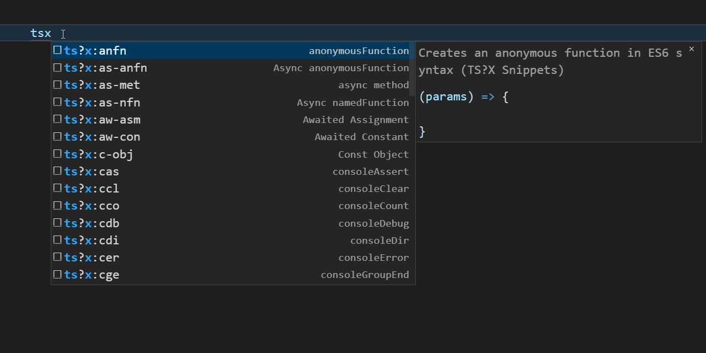
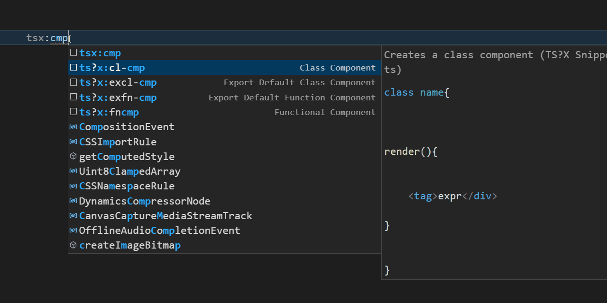

# TS-X-snippets

The creation of TS?X Snippets is to allow developers to write simple snippets for code that is written on a day-by-day basis.
The snippets are created to be practical, generic and inclusive to java and typescript developers. You can use classes class Components and even use functions and functional Components.

## Keywords

Most of the snippets in this repo are created with some important keywords.

> [Tip]: It's best to remember them when in doubt. Remember to type ts first if you are not getting good results.  

- `as` stands for `async`
- `aw` stands for `await`
- `fn` stands for `function`
- `c` stands for `console`
- `n` stands for `named`
- `af` stands for **arrow** `function`
- `met` stands for **method**
- `obj` stands for **object**
- `im` stands for `import`
- `ex` stands for `export`
- `cl` stands for `class`
- `cmp` stands for **component**

## Features

- Has Component Snippets
- Has Class Snippets
- Has Function Snippets
- Has Module Snippets
- Has Console Log Snippets
- Has Set Timeout and Interval Snippets

<!-- 
> Tip: Many popular extensions utilize animations. This is an excellent way to show off your extension! We recommend short, focused animations that are easy to follow. -->

## Requirements

You should be using typescript or javascript if you are using this extension. I will not support `.mjs` or `.cjs`.
Use ESM for the sake of your sanity and mine.

## Recommendations

Please use this extension with each of these other Extensions.

- Pretty Typescript Errors
- Total Typescript
- For Angular Devs Angular Snippets
- For Vue Devs Vue Snippets
- For React Devs ES7+ React/Redux/React-Native  Snippets
- For Astro Devs Astro Snippets
- For Solid Devs Solid Snippets
- For Svelte Devs Svelte 3 Snippets

<!-- ## Known Issues

Calling out known issues can help limit users opening duplicate issues against your extension. -->

<!-- ## Working with Markdown

You can author your README using Visual Studio Code. Here are some useful editor keyboard shortcuts:

* Split the editor (`Cmd+\` on macOS or `Ctrl+\` on Windows and Linux).
* Toggle preview (`Shift+Cmd+V` on macOS or `Shift+Ctrl+V` on Windows and Linux).
* Press `Ctrl+Space` (Windows, Linux, macOS) to see a list of Markdown snippets.

## For more information

* [Visual Studio Code's Markdown Support](http://code.visualstudio.com/docs/languages/markdown)
* [Markdown Syntax Reference](https://help.github.com/articles/markdown-basics/)

**Enjoy!** -->
